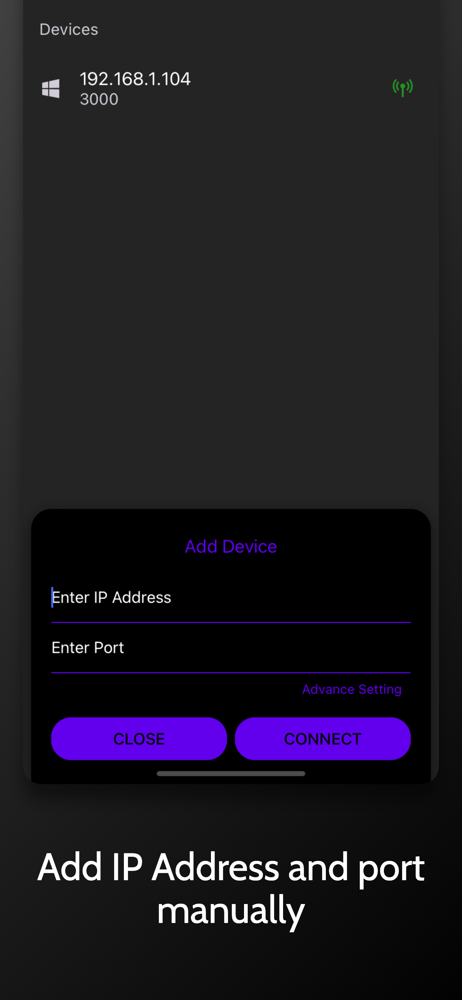
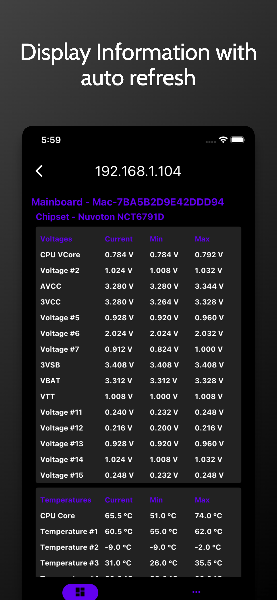
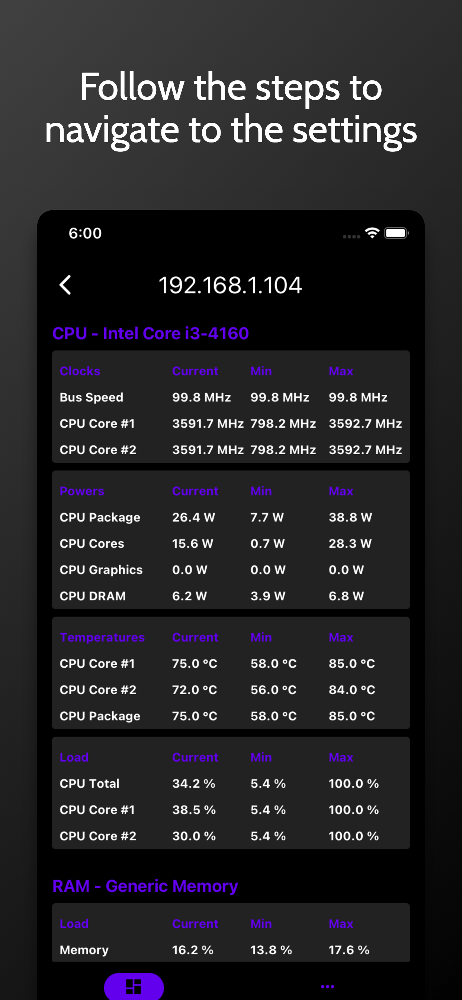
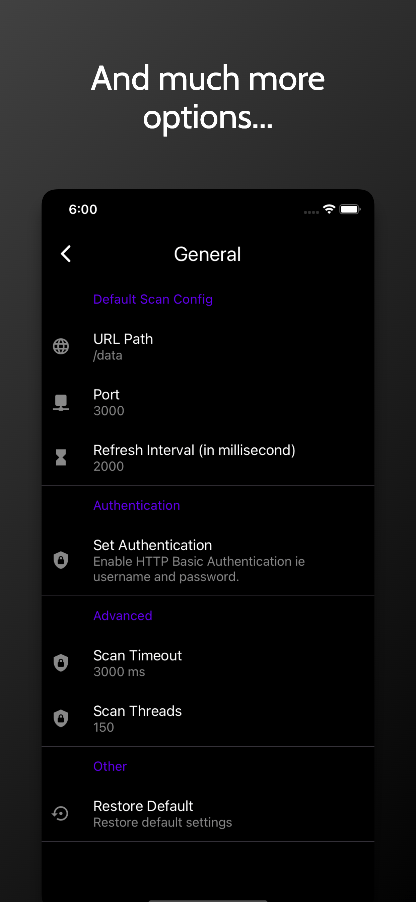

# Introduction

`OHM-Client` is an unofficial open-source open hardware monitor client app for android and iOS written in react-native. Using this app you can monitor open hardware monitor web server.

## Installation

Get app from Google Play:

### Screenshots

|               Auto Scan Network               |                Add Device Manually                |                Home - 1                 |                Home - 2                 |                 Setting                  |
|:---------------------------------------------:|:-------------------------------------------------:|:---------------------------------------:|:---------------------------------------:|:----------------------------------------:|
|  |  |  |  |  |

The application supports Android 5.0 (API 21) and above.

## Features include:

- Auto scan live open hardware monitor remote web server.
- Add manually remote web server using ip address and port.
- Auto refresh system information from remote web server.
- Dark theme support.
- Multi-language support.

## Building

### Basic setup

If you want to build from source, just do

    git clone https://github.com/gajjartejas/OHM-Client.git
    cd OHM-Client
    `npm install` or `yarn`
    cd ios && pod install && cd..

### With Android Studio

1. Clone repo `git clone https://github.com/gajjartejas/OHM-Client.git`
2. In Android Studio selection "Open an existing Android Studio Project"
3. Wait for Gradel to sync and then run or build.

### With Xcode

1. Clone repo `git clone https://github.com/gajjartejas/OHM-Client.git`
2. Navigate to `OHM-Client/ios` and open `OpenHardwareMonClient.xcworkspace` folder.
3. Run the project.

## Todo

1. List all remote web server within network. - Done
2. Share text, pdf via react-native-share, print system info or html download.
3. Realtime chart.
4. Take a snapshot of data in database at particular time or manually.
5. Display data over internet.
6. Widget support.
7. Alert based on cpu usage, gpu usage or device goes to offline.
8. Firebase realtime support with separate electron app that sync data with firebase/ login and QR code support.

## Contributing

There are many ways you can contribute to the development.

- Pull requests are always welcome!
- You must respect conventional commits for your commits and MR title.
- You can merge only if your CI is green.
- give priority to squash and merge, and not merge with a merge commit
- Please visit [CrowdIn](https://crowdin.com/project/openhardwaremonitorclient) in order to update and create new translations

## License

OHM-Client is licensed under the [MIT License](https://github.com/gajjartejas/OHM-Client/blob/main/LICENSE).
