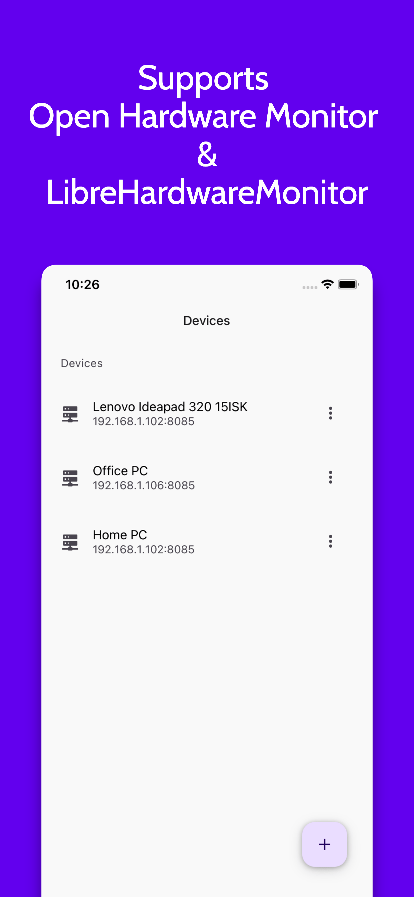
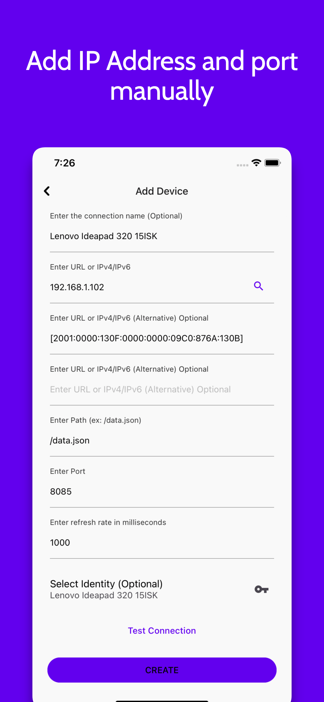
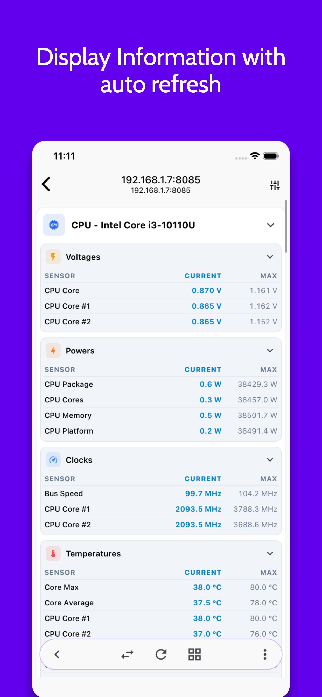
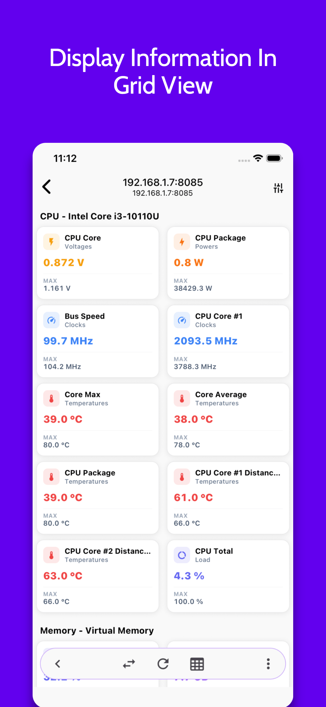
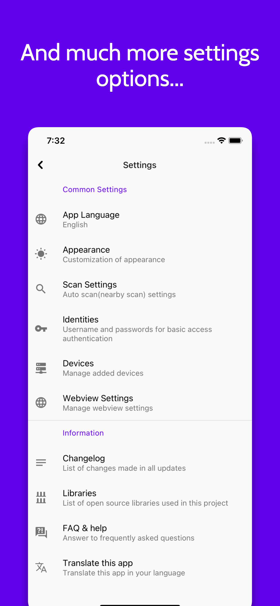
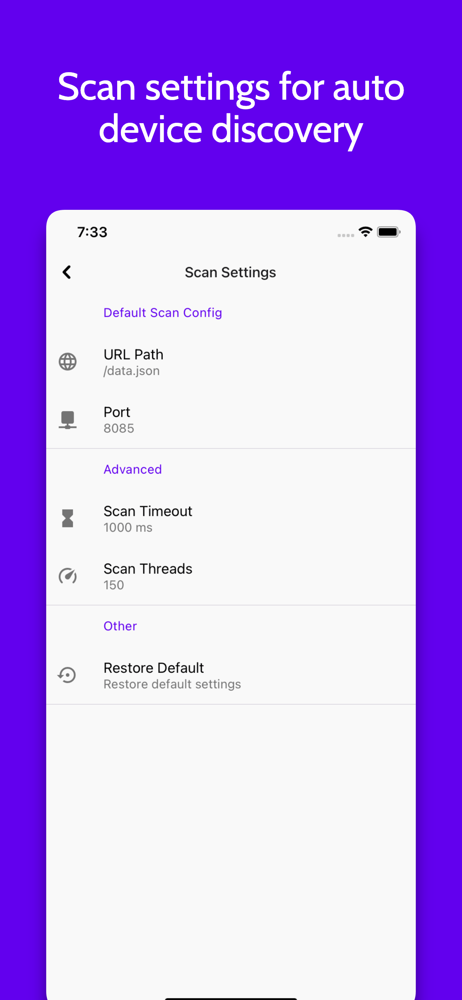
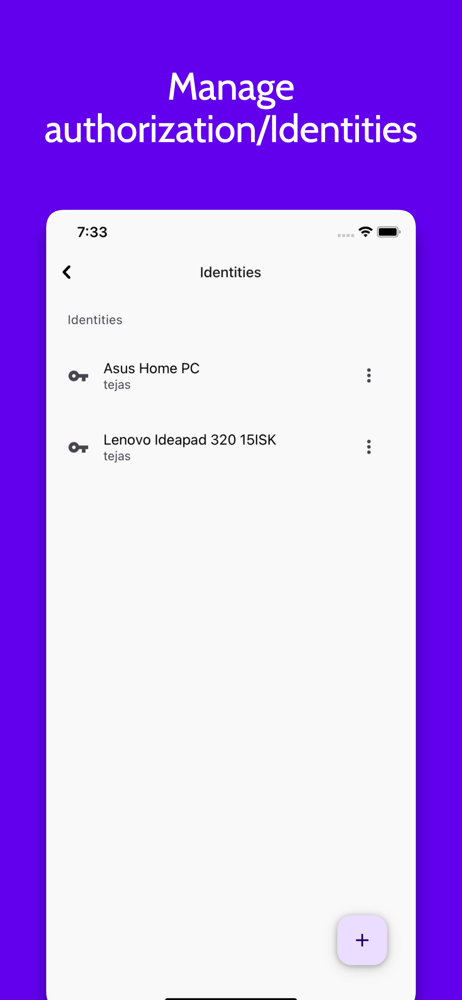
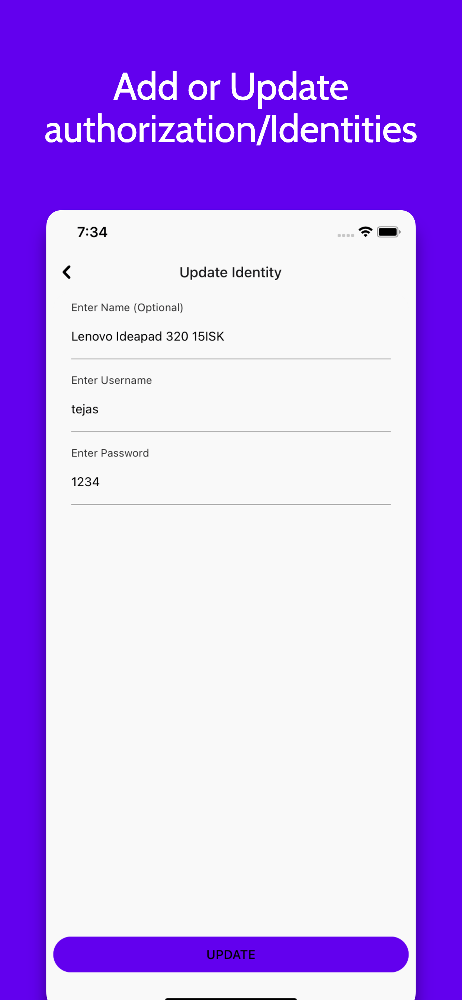
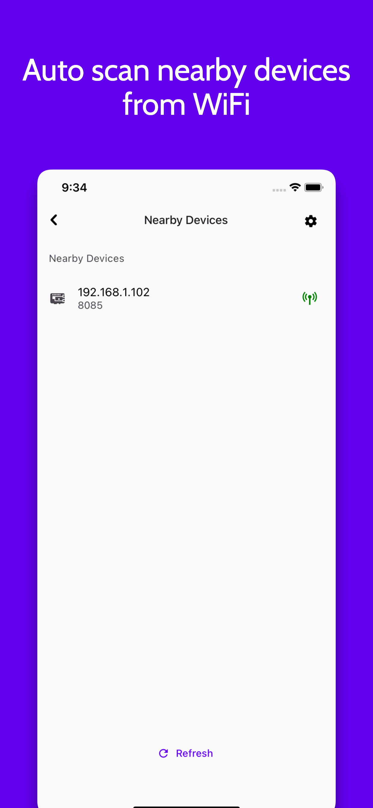
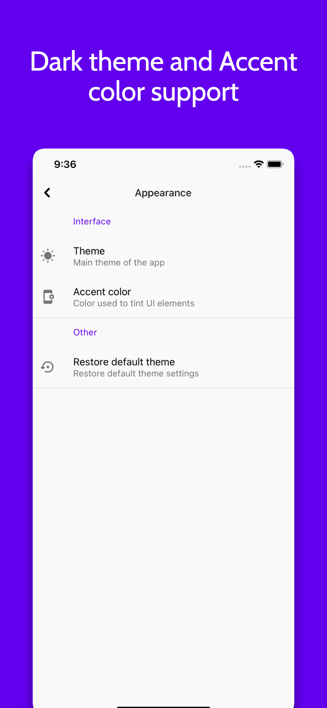

[](http://www.instagram.com/gajjartejas)
[](http://www.twitter.com/gajjartejas)

# Introduction

`OHM-Client` is an unofficial open-source Open Hardware Monitor and Libre Hardware Monitor client app for Android and iOS written in React Native. Using this app you can monitor Open Hardware Monitor / Libre Hardware Monitor web servers remotely.

## Installation

Get the app from Google Play:

<a href="https://play.google.com/store/apps/details?id=com.tejasgajjar.ohmc">
  
</a>

### Screenshots

|                                                |                                                    |                                          |                                          |                                           |
|:----------------------------------------------:|:--------------------------------------------------:|:----------------------------------------:|:----------------------------------------:|:-----------------------------------------:|
|  |  |  |  |   |
|  |  |  |  |  |

The application supports Android 5.0 (API 21) and above, and iOS 15.1 and above.

## Features include:

- Auto scan live Open Hardware Monitor / Libre Hardware Monitor web servers across your local network.
- Basic authentication support with secure identities management.
- Add manually or scan automatically remote web servers using IP address and port.
- Auto refresh system information from the remote web server with custom polling rates.
- WebView monitoring mode for advanced hardware telemetry.
- Dark theme and accent color customization.
- Multi-language localization support.

## Building
>  Note: You can't Publish any Source code without permission.

### Basic setup

```sh
git clone https://github.com/gajjartejas/OHM-Client.git
cd OHM-Client
npm install
```

### With Android Studio / Android CLI

```sh
# Start Metro bundler
npm start

# In another terminal, run on connected device/emulator
npm run android
```

Or open the `android` folder directly in Android Studio and run.

### With Xcode / iOS CLI

```sh
# Install CocoaPods
cd ios && bundle exec pod install && cd ..

# Run iOS app
npm run ios
```

Or open `ios/OHMC.xcworkspace` in Xcode and run.

## Contributing

There are many ways you can contribute to the development:

- Pull requests are always welcome!
- Respect conventional commits for your commits and PR titles.
- Please visit [CrowdIn](https://crowdin.com/project/openhardwaremonitorclient) to update and create new translations.

## License

OHM-Client is licensed under the [MIT License](LICENSE).
